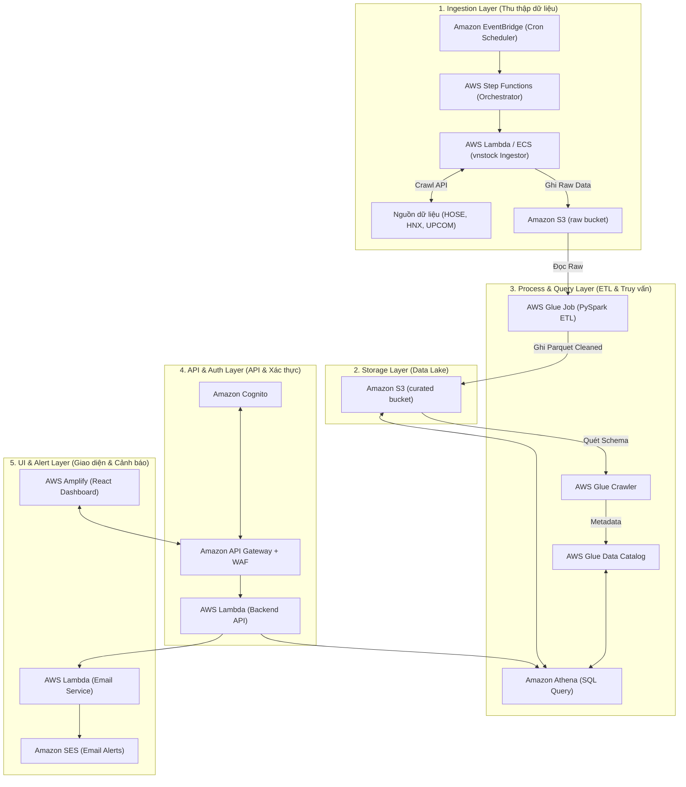

# 5.1. GIỚI THIỆU & KIẾN TRÚC HỆ THỐNG SERVERLESS

#### 🎯 Mục tiêu bài workshop
Trong dự án này, nhóm mình xây dựng một **Hệ thống Thu thập và Phân tích Dữ liệu Tài chính Chứng khoán Việt Nam trên nền tảng AWS Serverless**. Hệ thống tự động thu thập báo cáo tài chính từ 3 sàn chứng khoán (**HOSE, HNX, UPCOM**), thực hiện quy trình ETL chuẩn hóa dữ liệu, tính toán bộ chỉ số tài chính (Liquidity, Profitability, Leverage, Size) và gán nhãn dự đoán nguy cơ **Kiệt quệ Tài chính (Financial Distress)** dựa trên tiêu chuẩn tài chính Việt Nam kết hợp điểm số **Altman Z-Score**.

#### 🏗️ Kiến trúc Hệ thống AWS Cloud (5 Phân vùng chính)

Mô hình kiến trúc tổng quan của dự án bao gồm 5 lớp xử lý độc lập:

#### 🛠️ Danh mục các Dịch vụ AWS chính được sử dụng:

| Lớp Phân Vùng | Dịch vụ AWS | Trách nhiệm trong Bài Lab |
| :--- | :--- | :--- |
| **1. Data Ingestion** | `Amazon EventBridge` | Kích hoạt định kỳ (Cron Schedule) luồng cào dữ liệu BCTC quý/năm |
| | `AWS Step Functions` | Điều phối workflow thu thập dữ liệu đa luồng, xử lý retry và checkpointing |
| | `AWS Lambda` | Gọi API/Crawl từ `vnstock` và ghi dữ liệu thô dạng JSON/CSV vào S3 |
| **2. Storage** | `Amazon S3 (raw)` | Lưu trữ dữ liệu thô Bảng Cân đối kế toán, KQKD, Lưu chuyển tiền tệ |
| | `Amazon S3 (curated)` | Lưu trữ dữ liệu đã làm sạch, tính chỉ số tài chính dạng **Parquet** |
| **3. Process & Query**| `AWS Glue Job` | Đảm nhận ETL: Mapping chỉ tiêu BCTC, Winsorization, tính Z-Score |
| | `AWS Glue Data Catalog`| Quản lý Metadata Schema cho toàn bộ dataset tài chính |
| | `Amazon Athena` | Truy vấn SQL Serverless trực tiếp trên S3 curated |
| **4. API & Auth** | `Amazon Cognito` | Quản lý đăng nhập, phân quyền và cấp JWT Token cho Web UI |
| | `Amazon API Gateway` | Tiếp nhận RESTful API request từ Frontend có tường lửa `AWS WAF` |
| | `AWS Lambda (Backend)`| Xử lý nghiệp vụ backend, gửi truy vấn SQL tới Athena và trả kết quả JSON |
| **5. Dashboard & Alert**| `AWS Amplify` | Hosting & Deployment ứng dụng Web Dashboard (React/Next.js) |
| | `Amazon SES` | Tự động gửi Email cảnh báo khi phát hiện doanh nghiệp có nguy cơ phá sản |
