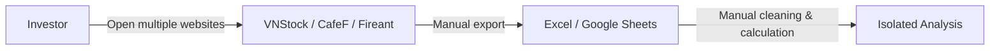
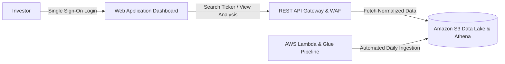

# 5.1.1. Background, Objectives and Scope

### 1. Problem Statement & Context
In the current financial landscape in Vietnam, investors seeking market intelligence face significant operational fragmentation:
* **Fragmented Data Sources**: Individual retail investors and financial analysts are forced to check multiple disconnected platforms (VNStock, CafeF, SSI iBoard, Fireant, HOSE, HNX, etc.).
* **Manual & Unstandardized Workflows**: Raw market data is collected manually into spreadsheets (Excel/Google Sheets). Raw datasets lack standardized schemas, exhibit missing/inconsistent records across sources, and lack pre-computed technical indicators.
* **Absence of Structured Long-Term Storage**: No central, structured, long-term data repository exists to support advanced analytics or machine learning.
* **AI/ML & Quant Model Pipeline Requirement**: Standardized datasets serve not only display dashboards, but also act as direct feature store inputs to train lightweight AI Agents and Machine Learning models (e.g., Financial Distress Prediction, Trend Forecasting, Transaction Anomaly Detection). This requires strict data contracts (feature schema inputs, prediction schemas, confidence scores, and time windows) defined directly at the ETL and Data Lake layers.

---

### 2. High-Level Approach
To resolve these bottlenecks, the platform implements a 5-tier AWS Serverless architecture:
1. **Automated Ingestion Pipeline**: Ingest data from verified financial data providers using scheduled serverless collectors.
2. **Automated Data Processing & Quality Enforcement**: Deduplicate raw payloads, enforce standardized schemas, compute technical indicators (MA20, RSI14, return_pct), and aggregate recent high-impact financial news.
3. **Multi-Tiered Data Lake Architecture**: Store data in Amazon S3 across logical zones (`Raw`, `Curated`, and `Feature Store`) to serve both real-time UI dashboards and offline ML model training pipelines.
4. **Cloud-Native AWS Serverless Ecosystem**: Leverage Amazon S3, AWS Lambda, AWS Glue, Amazon Athena, Amazon DynamoDB, AWS Cognito, Amazon SES, and AWS Amplify for high availability, automatic scaling, and minimal operational overhead.
5. **Infrastructure as Code (IaC)**: Deploy and manage all cloud resources using Terraform modules for environment consistency (Dev vs. Demo) and automated setup.

---

### 3. Business Flow Transformation (As-Is vs. To-Be)

#### As-Is Workflow (Current Manual State)

* **Pain Points**: Time-consuming, manual data duplication, inconsistent formulas, high human error rate, no real-time alert capability.

#### To-Be Workflow (Automated Platform State)

* **Benefits**: Single unified dashboard, automated daily ETL, guaranteed data integrity, instant technical indicator calculation, and automatic email notifications.

---

### 4. Target Customer Profiles
* **Individual Retail Investors**: Investors looking for a single-source platform to query financial statements, technical charts, watchlist management, and daily market alerts.
* **Quantitative Analysts & AI Developers**: Internal/external developers requiring standardized S3 Parquet datasets and feature store schemas for backtesting algorithms and training financial distress/trend models.
