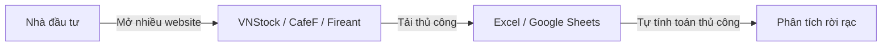
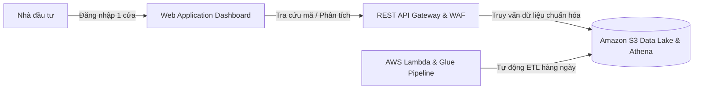

# 5.1.1. Bối cảnh, mục tiêu và phạm vi

### 1. Bối cảnh bài toán (Problem Statement)
Thị trường tài chính chứng khoán Việt Nam hiện nay đang tồn tại nhiều bất cập lớn đối với nhà đầu tư và các nhà phân tích dữ liệu:
* **Nguồn dữ liệu rời rạc**: Nhà đầu tư cá nhân và các chuyên viên phân tích phải xem qua rất nhiều nền tảng khác nhau (VNStock, CafeF, SSI iBoard, Fireant, HOSE, HNX...) một cách thủ công.
* **Quy trình tổng hợp thủ công & Chưa chuẩn hóa**: Dữ liệu thu thập về thường được xử lý trên Excel/Google Sheet, chưa được xử lý làm sạch, dễ bị hao hụt/trùng lặp giữa các nguồn, và chưa tính toán sẵn các chỉ báo kỹ thuật quan trọng.
* **Thiếu hạ tầng lưu trữ lâu dài**: Chưa có nơi lưu trữ dữ liệu tài chính lâu dài, có cấu trúc chuẩn để phục vụ các ứng dụng phân tích chuyên sâu.
* **Nhu cầu đầu vào cho mô hình AI/ML**: Bộ dữ liệu sau khi chuẩn hóa không chỉ phục vụ hiển thị lên Web Dashboard, mà còn là đầu vào trực tiếp (Feature Store) để huấn luyện các mô hình Machine Learning / AI Agent (như dự đoán nguy cơ kiệt quệ tài chính - financial distress, dự báo xu hướng giá, phát hiện bất thường giao dịch). Điều này đòi hỏi ngay từ tầng ETL và Data Lake phải định nghĩa rõ ràng cấu trúc dữ liệu đầu vào (feature schema) và đầu ra kỳ vọng.

---

### 2. Hướng tiếp cận tổng quan (High-level Approach)
Để giải quyết triệt để bài toán trên, dự án xây dựng hạ tầng Đám mây AWS Serverless với 5 phân vùng chức năng:
1. **Thu thập dữ liệu tự động (Ingestion)**: Xây dựng hệ thống tự động trích xuất dữ liệu từ các nguồn uy tín đã được kiểm định theo lịch biểu.
2. **Tự động xử lý & Chuẩn hóa**: Loại bỏ dữ liệu rác/trùng lặp, chuẩn hóa schema chung, tự động tính toán bộ chỉ số kỹ thuật (MA20, RSI14, return_pct) và tổng hợp tin tức tài chính.
3. **Kiến trúc Data Lake đa tầng**: Lưu trữ dữ liệu trên Amazon S3 theo các phân vùng (`Raw`, `Curated`, `Feature Store`) phục vụ song song cả bài toán hiển thị tức thì và bài toán huấn luyện AI offline.
4. **Hạ tầng AWS Serverless 100%**: Sử dụng Amazon S3, AWS Lambda, AWS Glue, Amazon Athena, Amazon DynamoDB, AWS Cognito, Amazon SES và AWS Amplify giúp tự động co giãn, tính sẵn sàng cao và tối ưu chi phí.
5. **Quản lý bằng Infrastructure as Code (IaC)**: Đóng gói toàn bộ tài nguyên hạ tầng bằng Terraform giúp dễ dàng triển khai, nhân bản môi trường (Dev/Demo) và đảm bảo tính nhất quán.

---

### 3. Chuyển đổi quy trình nghiệp vụ (As-Is vs. To-Be)

#### Quy trình hiện trạng (As-Is Workflow)

* **Bất cập**: Tốn thời gian, dữ liệu không nhất quán giữa các nguồn, dễ sai sót con người, không có cảnh báo tự động.

#### Quy trình sau khi có hệ thống (To-Be Workflow)

* **Ưu điểm**: Giao diện tập trung, tự động thu thập và ETL hàng ngày, dữ liệu chính xác tuyệt đối, tính sẵn chỉ số kỹ thuật, gửi email cảnh báo tự động.

---

### 4. Đối tượng khách hàng mục tiêu (Target Customer)
* **Nhà đầu tư cá nhân tại Việt Nam**: Nhu cầu tra cứu báo cáo tài chính, biểu đồ kỹ thuật, quản lý danh mục đầu tư (portfolio), watchlist và nhận thông báo cảnh báo thị trường tự động.
* **Nhà phân tích dữ liệu & Kỹ sư AI**: Các đội ngũ nội bộ hoặc nhà phát triển bên ngoài cần truy xuất bộ dữ liệu Parquet/Feature Store chuẩn hóa trên S3 để chạy backtest thuật toán và huấn luyện các mô hình dự báo tài chính.
