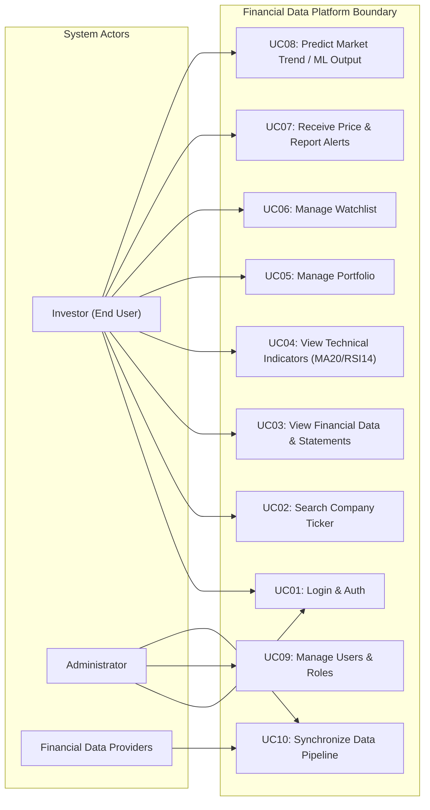
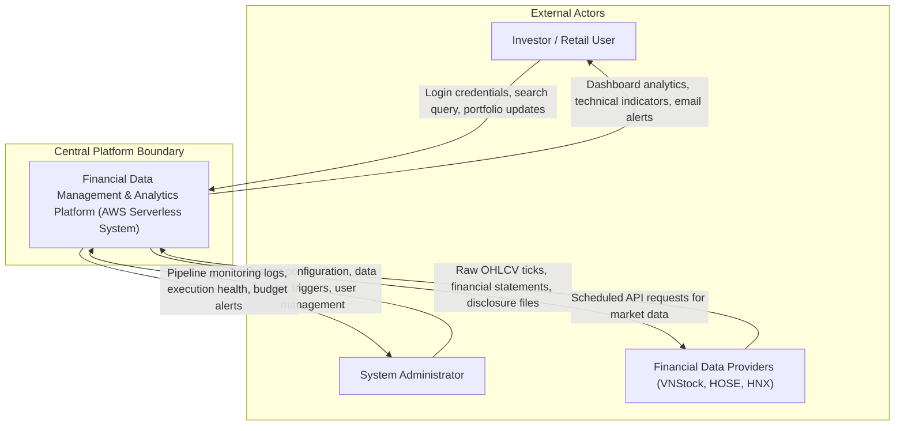

# 5.1.4. Actors and Use Cases Analysis

### 1. Distinction Between Actors vs. Stakeholders
In system architecture modeling (UML & C4 Model), it is critical to distinguish between **Actors** and **Stakeholders**:
* **Actors**: Entities (users, administrators, or external systems) that directly send or receive requests/interactions with the system boundary.
* **Stakeholders**: Entities that have a business or operational interest in the project outcomes, but do NOT directly initiate or receive requests with the system boundary. For instance, **AWS Cloud Provider** is a major project stakeholder, but AWS is NOT an actor in the Use Case Diagram because human users interact with the platform, and the platform internally calls AWS services.

---

### 2. System Actor Categorization

#### Primary Actors (Internal Direct Users)
1. **Investor (Retail Investor / End User)**:
   * **Goal**: Search stocks, view normalized financial reports, display technical charts, manage watchlists/portfolios, receive email alerts, and export structured datasets for custom algorithms.
   * **Pain Point Solved**: Eliminates multi-website hopping, unifies fragmented data, and provides pre-calculated technical metrics.
2. **Administrator (System Admin / Operator)**:
   * **Goal**: Manage user accounts, trigger manual data synchronization, monitor ingestion health, and review CloudWatch/AWS Budget alarms.
   * **Pain Point Solved**: Provides real-time visibility into data pipeline health and cost consumption.

#### Secondary / External Actors (External Systems)
1. **Financial Data Providers (VNStock, HOSE, HNX, CafeF, Fireant)**:
   * **Role**: External data services supplying raw OHLCV market ticks, financial statements, and news announcements to the system's ingestion endpoints.

---

### 3. Use Case Diagram Representation

---

### 4. C4 Model Level 1: System Context Diagram

#### System Context Data Interaction Matrix

| Actor / System | Data Sent to Platform | Data Received from Platform |
| :--- | :--- | :--- |
| **Investor** | Login credentials, Ticker queries, Watchlist & Portfolio updates | Dashboard charts, financial ratios, MA20/RSI14 indicators, Email alerts |
| **Administrator** | Ingestion config, manual sync triggers, user role modifications | CloudWatch metrics, pipeline execution status, AWS Budget alerts |
| **Data Providers** | Raw JSON market payloads, financial statements, news feeds | Scheduled HTTPS API requests from AWS Lambda Collector |
