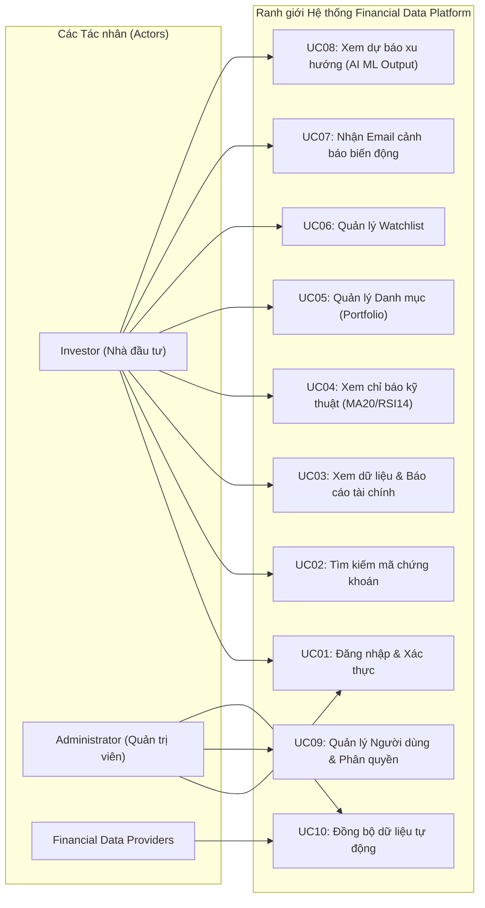
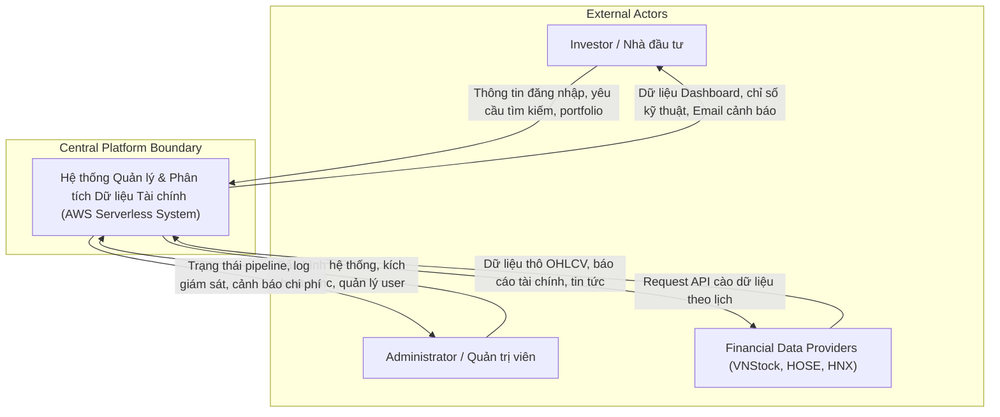

# 5.1.4. Phân tích Actor và Use Cases

### 1. Phân biệt Actor và Stakeholder
Trong thiết kế kiến trúc hệ thống (UML và C4 Model), việc phân định rõ giữa **Actor** và **Stakeholder** có ý nghĩa rất quan trọng:
* **Actor**: Là các đối tượng (người dùng, quản trị viên, hoặc hệ thống bên ngoài) trực tiếp gửi request hoặc nhận response qua biên giới hệ thống (System Boundary).
* **Stakeholder**: Là các bên có lợi ích liên quan đến dự án nhưng KHÔNG tương tác trực tiếp với ranh giới Use Case. Ví dụ: **AWS Cloud Provider** là stakeholder cung cấp hạ tầng, nhưng AWS KHÔNG phải là actor trong sơ đồ Use Case hay Context Diagram vì người dùng tương tác với hệ thống, còn hệ thống mới tự gọi các dịch vụ AWS.

---

### 2. Phân loại Actor trong hệ thống

#### Primary Actors (Nhóm Actor tương tác trực tiếp)
1. **Investor (Nhà đầu tư cá nhân / Khách hàng)**:
   * **Mục tiêu**: Tìm kiếm mã chứng khoán, xem báo cáo tài chính đã chuẩn hóa, xem biểu đồ chỉ báo kỹ thuật, quản lý danh mục (portfolio), danh sách theo dõi (watchlist), nhận email cảnh báo và xuất dữ liệu chuẩn hóa.
   * **Pain Point được giải quyết**: Không phải mở nhiều trang web rời rạc, dữ liệu được tự động hợp nhất và tính toán sẵn chỉ số.
2. **Administrator (Quản trị viên hệ thống)**:
   * **Mục tiêu**: Quản lý tài khoản user, kích hoạt đồng bộ dữ liệu thủ công khi cần, giám sát tình trạng pipeline và nhận cảnh báo chi phí AWS Budgets.
   * **Pain Point được giải quyết**: Giám sát tập trung toàn bộ luồng dữ liệu và chi phí hạ tầng theo thời gian thực.

#### Secondary / External Actors (Actor hệ thống bên ngoài)
1. **Financial Data Providers (VNStock, HOSE, HNX, CafeF, Fireant)**:
   * **Vai trò**: Nguồn cung cấp dữ liệu thô (OHLCV, Báo cáo tài chính, Tin tức) cho hàm cào dữ liệu của hệ thống.

---

### 3. Sơ đồ Use Case tổng quan (Use Case Diagram)

---

### 4. Sơ đồ C4 Model Level 1: System Context Diagram

#### Ma trận tương tác dữ liệu (System Context Data Matrix)

| Actor / Hệ thống | Dữ liệu gửi đến Hệ thống | Dữ liệu nhận từ Hệ thống |
| :--- | :--- | :--- |
| **Investor** | Thông tin đăng nhập, Ticker tìm kiếm, Cập nhật Watchlist & Portfolio | Dữ liệu Dashboard, Báo cáo tài chính, Chỉ số MA20/RSI14, Email cảnh báo |
| **Administrator** | Cấu hình Ingestion, Kích hoạt sync thủ công, Phân quyền user | Log truy vết CloudWatch, Trạng thái chạy Glue Job, Cảnh báo AWS Budgets |
| **Data Providers** | Payload JSON thô, file báo cáo tài chính, tin tức doanh nghiệp | Các HTTPS Request đặt lịch từ AWS Lambda Collector |
