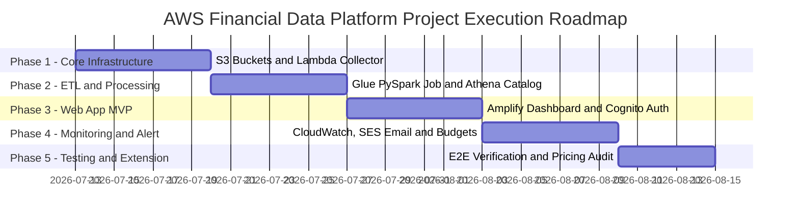
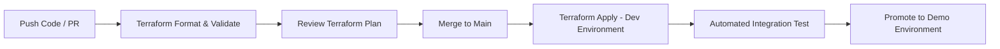

# 5.1.5. Proposed Execution Plan (Starting Week 4)

### 1. Project Phase Roadmap (Phased Launch Plan)
The project implementation roadmap is structured into **5 distinct execution phases**, commencing in **Week 4** following the initial research and architecture proposal phase:

#### Phase Breakdown & Key Deliverables

* **Phase 1: Foundation & Ingestion Infrastructure (Week 4)**:
  * Provision S3 Raw Bucket (`my-data-lake-raw-699061130094-dev`) and S3 Curated Bucket (`my-data-lake-curated-699061130094-dev`).
  * Develop Python script inside AWS Lambda (`financial-data-collector`) to ingest raw JSON from `VNStock`.
  * Create modular Terraform configuration (`modules/s3`, `modules/lambda`).
* **Phase 2: Data Processing & Cataloging (Week 5)**:
  * Configure IAM Role (`AWSGlueETLProcessorRole-dev`).
  * Develop AWS Glue PySpark job (`ohlcv-glue-processor`) to clean JSON, compute MA20, RSI14, return_pct, and output Snappy-compressed Hive Parquet partitions (`ticker=XXX/`).
  * Set up Glue Crawler (`ohlcv-crawler`) and Amazon Athena database (`financial_data_lake`).
* **Phase 3: Web Application & Authentication MVP (Week 6)**:
  * Set up DynamoDB NoSQL tables (`Users`, `UserWatchlists`).
  * Deploy Cognito User Pool (`financial-data-user-pool-dev`) for authentication.
  * Build REST API Gateway protected by Cognito Authorizers & AWS WAF rules.
  * Deploy React Web Dashboard on AWS Amplify CDN.
* **Phase 4: Monitoring, Notification & Observability (Week 7)**:
  * Configure Amazon SES verified domain and HTML report template Lambda function (`financial-data-email`).
  * Set up CloudWatch Alarms for Lambda errors/timeouts and Glue job failures.
  * Configure AWS Budgets alerts at 50%, 80%, and 100% threshold limits.
* **Phase 5: End-to-End Testing & Cost Audit (Final Week)**:
  * Conduct End-to-End pipeline testing from data source crawling to S3 curated Parquet to Amplify UI display.
  * Audit total cloud consumption via AWS Pricing Calculator and CloudWatch dashboards.

---

### 2. CI/CD & Terraform IaC Pipeline Workflow
To ensure consistent deployments across Dev and Demo environments, the project enforces a standardized Terraform GitOps workflow:

---

### 3. Weekly Task Allocation & Deliverable Matrix (Starting Week 4)

| Week # | Primary Focus Area | Key Technical Tasks | Responsible Module |
| :--- | :--- | :--- | :--- |
| **Week 4** | Ingestion & S3 Landing Zone | Create S3 Raw/Curated buckets, write Lambda collector, schedule EventBridge daily cron | `modules/s3`, `modules/lambda` |
| **Week 5** | Glue PySpark ETL & Athena | Write Glue PySpark normalization job, setup Glue Crawler, test SQL queries on Athena | `modules/glue`, `modules/athena` |
| **Week 6** | Auth, API & Dashboard | Build DynamoDB tables, Cognito User Pool, REST API Gateway, deploy Amplify FE | `modules/cognito`, `modules/amplify` |
| **Week 7** | Monitoring & Email Alerts | Verify SES sender, build Lambda Email function, configure CloudWatch Alarms & Budgets | `modules/monitoring`, `modules/ses` |
| **Week 8** | E2E Testing & Cleanup | Run end-to-end integration tests, verify pricing calculator, finalize documentation | Workshop Final Documentation |
