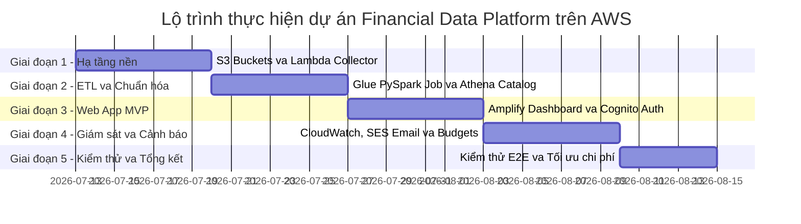
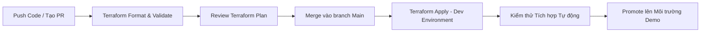

# 5.1.5. Kế hoạch thực hiện dự kiến (bắt đầu từ tuần 4)

### 1. Lộ trình triển khai theo giai đoạn (Phased Launch Plan)
Kế hoạch thực hiện dự án được chia thành **5 giai đoạn chiến lược**, chính thức bắt đầu từ **Tuần 4** (sau giai đoạn hoàn tất nghiên cứu đề xuất và thiết kế kiến trúc ban đầu):

#### Chi tiết công việc từng giai đoạn

* **Giai đoạn 1: Hạ tầng nền & Thu thập dữ liệu (Tuần 4)**:
  * Khởi tạo S3 Raw Bucket (`my-data-lake-raw-699061130094-dev`) và S3 Curated Bucket (`my-data-lake-curated-699061130094-dev`).
  * Viết mã nguồn Python cho AWS Lambda (`financial-data-collector`) trích xuất JSON thô từ `VNStock`.
  * Đóng gói hạ tầng bằng Terraform module (`modules/s3`, `modules/lambda`).
* **Giai đoạn 2: Xử lý dữ liệu ETL & Data Catalog (Tuần 5)**:
  * Cấu hình IAM Role (`AWSGlueETLProcessorRole-dev`).
  * Viết AWS Glue PySpark job (`ohlcv-glue-processor`) làm sạch dữ liệu, tính MA20, RSI14, return_pct và ghi file Parquet nén Snappy phân vùng theo Ticker (`ticker=XXX/`).
  * Cấu hình Glue Crawler (`ohlcv-crawler`) và tạo Database Athena (`financial_data_lake`).
* **Giai đoạn 3: Web App MVP & Xác thực (Tuần 6)**:
  * Khởi tạo các bảng DynamoDB NoSQL (`Users`, `UserWatchlists`).
  * Cấu hình Cognito User Pool (`financial-data-user-pool-dev`) xác thực người dùng.
  * Dựng REST API Gateway bảo mật bằng Cognito Authorizer & AWS WAF.
  * Triển khai giao diện React Web Dashboard trên AWS Amplify CDN.
* **Giai đoạn 4: Giám sát, Cảnh báo & Tối ưu chi phí (Tuần 7)**:
  * Xác thực email Admin trên Amazon SES, viết Lambda Email (`financial-data-email`) gửi báo cáo HTML.
  * Cấu hình CloudWatch Alarms cảnh báo lỗi Lambda và Glue job thất bại.
  * Thiết lập AWS Budgets cảnh báo ngưỡng chi phí 50%, 80%, và 100%.
* **Giai đoạn 5: Kiểm thử toàn diện & Tổng kết (Tuần cuối)**:
  * Thực hiện kiểm thử End-to-End toàn bộ luồng từ cào dữ liệu đến hiển thị trên Web Dashboard.
  * Ước tính và đối soát chi phí thực tế bằng AWS Pricing Calculator và CloudWatch Dashboard.

---

### 2. Quy trình CI/CD & Quản lý hạ tầng bằng Terraform (IaC)
Đảm bảo đồng bộ và tự động hóa triển khai giữa môi trường Dev và Demo thông qua pipeline GitOps Terraform:

---

### 3. Bảng phân công nhiệm vụ theo tuần (Bắt đầu từ Tuần 4)

| Tuần số | Trọng tâm công việc | Các tác vụ kỹ thuật chính | Module chịu trách nhiệm |
| :--- | :--- | :--- | :--- |
| **Tuần 4** | Ingestion & S3 Landing Zone | Khởi tạo S3 Raw/Curated, viết Lambda Collector, cấu hình EventBridge Cron | `modules/s3`, `modules/lambda` |
| **Tuần 5** | Glue PySpark ETL & Athena | Viết PySpark job chuẩn hóa dữ liệu, cấu hình Glue Crawler, kiểm thử SQL Athena | `modules/glue`, `modules/athena` |
| **Tuần 6** | Auth, API & Dashboard | Dựng DynamoDB, Cognito User Pool, REST API Gateway, deploy Web Amplify | `modules/cognito`, `modules/amplify` |
| **Tuần 7** | Monitoring & Email Alerts | Xác thực SES, viết Lambda Email báo cáo, cấu hình CloudWatch Alarms & Budgets | `modules/monitoring`, `modules/ses` |
| **Tuần 8** | Kiểm thử E2E & Dọn dẹp | Kiểm thử tích hợp end-to-end, đối soát Pricing Calculator, hoàn thiện tài liệu | Workshop Final Documentation |
